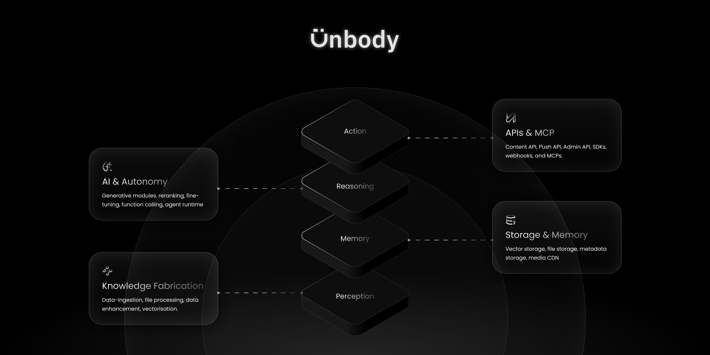

```
----------------------------------------
  __  __     __           __    
 / / / /__  / /  ___  ___/ /_ __
/ /_/ / _ \/ _ \/ _ \/ _  / // /
\____/_//_/_.__/\___/\_,_/\_, / 
                         /___/ .io
----------------------------------------
Perception > Memory > Reasoning > Action
```
# Unbody is the ~~Supabase~~ of the AI era

Unbody is an open-source, modular backend stack for building AI-native software that understands, reasons, and acts on knowledge(base)—instead of data(bases).

It’s designed to power a new generation of software: intelligent, context-aware, and autonomous by default.

### Start Building
→ [Start building](https://app.unbody.io)  
→ [Read the Docs](https://docs.unbody.io)  
→ [Join the Discord](https://discord.gg/unbody)

## Why Unbody?
Modern software isn’t static. We talk to it. We expect it to think, decide, and take action.  
Legacy stacks weren’t built for this shift. At the same time, the AI tooling ecosystem today is scattered and complex. Developers spend too much time duct-taping vector stores, embedding models, LLMs, pipelines, and APIs.

Supabase & similar solutions changed how we build traditional apps: one stack for storage, auth, and APIs.  
But that world was built on static data and predefined schemas.

We’re entering a new era—where software doesn’t just store information, but **understands**, **reasons**, and **acts**.  
Where users don’t just click—they ask, converse, and expect systems to respond intelligently.

That shift demands a new kind of backend.
Unbody brings the Supabase spirit to the AI-native era.

## How? 

To build towards a more human software, we designed Unbody around four layers:
- **Perception** (knowledge fabrication) — Ingest, parse, enhance, and vectorize raw data  
- **Memory** (Storage & persistent memory) — Store structured knowledge in vector DBs and persistent storage  
- **Reasoning** (AI & Autonomy) — Generate content, call functions, and plan actions  
- **Action** (APIs & MCP) — Expose knowledge via APIs, SDKs, and triggers
  
→ [Read more](https://docs.unbody.io/architecture)  

Each module is composable, pluggable, and open.

## Build With Unbody
- AI-powered chatbots & assistants (RAG+)
- Semantic search & recommendation engines
- Document understanding & AI-assisted workflows
- Autonomously acting backends & agents

*The knowledge-first backend for the AI-native era — built together, in the open.*
